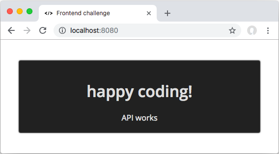

# Scout24 frontend challenge
Allong with the link to this repository, you got also an appointment timeframe, when the challenge happens.

## Preparation
1. Install
   - [Skype](https://www.skype.com/en/) - we need the chat only, no audio/camera.
   - [node](https://nodejs.org/en/download/) - at least v8.x
1. Connect to the Skype account you received and say "Hi, I'm preparing for the frontend challenge"
1. [Download this repository](https://github.com/Scout24-CH/frontend-challenge/archive/master.zip) and unpack it
1. Navigate to it's folder and run `npm i`
1. Run `npm start` - this will bring up a simple web server (port 8080) and an API (port 8081)
1. Navigate to [http://localhost:8080](http://localhost:8080) - and you should see this:

## Work
- You'll get the challenge description at the beginning, via Skype
- Time is 120 minutes
- Within this 120 minutes, you must send back your solution by skype or E-Mail
- You may ask us questions via skype, during the whole challenge.
- Code in whatever environment you feel confortable (IDE, Operating System)
- Whenever you get stuck, run `npm run reset` an restart the servers
- You may use the internet for research
- You can not use the help of other people or robots
- You only have **one try**, please be prepared and ready

## Presentation
- If we like your work, we'll invite you to our office in Flamatt (Switzerland)
- You get the chance to present and discuss your code 
- A couple of Scout24 developers and HR will be your audience
- A Q/A session follows the presentation, where we discuss some details
